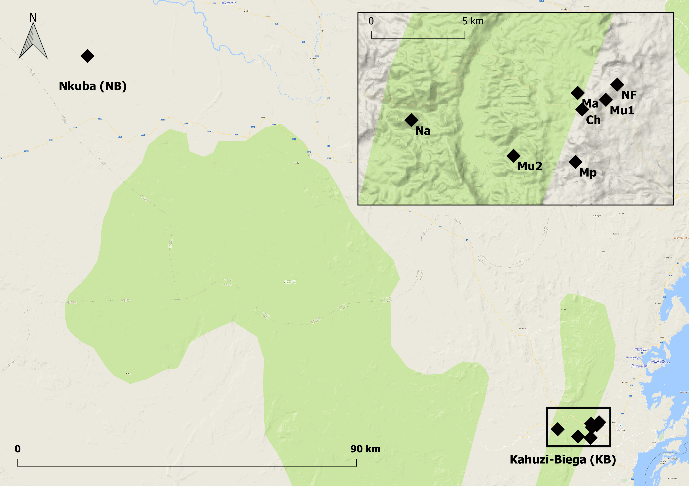

\includepdf[pages={-}]{/Users/rianaminocher/Google Drive/Uppsala/UPPMAX/3_analysis/5_vsearch/markdown/titlepage.pdf}

\newpage 

```{r setup, include=FALSE}
knitr::opts_chunk$set(fig.path = "chunks", echo = FALSE, warning = FALSE, message = FALSE, fig.pos = 'h')
```

## Abstract

The diversity and composition of the primate gut microbiome is affected by demography, environment and behaviour. Characterising gut microbial diversity and composition in two populations of Grauer's gorillas in the eastern part of the Democratic Republic of Congo reveals the influence of socio-ecology and demography on the gut microbiome. Geographically and genetically distinct populations have distinct microbial profiles, enriched with specific bacterial taxa. Furthermore, group-living Grauer's gorillas share a similar gut microbiota with same-group members. Kinship across the sample does not explain gut microbiome similarity, however, suggesting that horizontal social contact may be more important. Additionally, individual microbial diversity is not predicted by host demography, including sex, social group size and degree of habituation. However, juvenile gorillas appear to have lower microbial diversity compared with adults. These findings suggest that the Grauer's gorilla gut microbial community could be affected by a combination of life history, social interaction and local dietary adaptation. 

## Introduction

The community of bacteria living within the gut, the "gut microbiome", is affected by multiple factors, including demography (Tung et al. 2015, Moeller et al. 2016a), life-history (McKenney et al. 2015), habitat quality (Amato et al. 2013), seasonality (Gomez et al. 2016), diet (Carmody et al. 2015, Ma et al. 2014, Amato et al. 2015), as well as stress and anthropogenic pressure (Gomez et al. 2015). Gut microbial composition in turn impacts host reproduction, nutrition and behaviour. Microbiome studies therefore have implications for ecology, health and conservation of species (e.g. Amato et al. 2013, Ma et al. 2014, McCord et al. 2014). The composition and diversity of the gut bacterial community may be distinct between closely related species (Gomez et al. 2016), populations (Schnorr et al. 2014) and groups (Tung et al. 2015). Examining patterns of bacterial distribution and abundance between groups and populations within a single species allows inferences about species-specific ecology, such as local dietary adaptations, or social transmission of disease. An intraspecific comparison of two geographically isolated and genetically distinct populations of the critically endangered Grauer's gorilla *(Gorilla beringei graueri)* thus shows the complex interplay between host environment, behaviour, diet and gut microbial fauna, contributing to our understanding of gorilla socio-ecology. 

### Background
The Grauer's gorilla *(Gorilla beringei graueri)*, one of two eastern gorilla subspecies, is endemic to the eastern part of the Democratic Republic of Congo. Distributed over an altitudinal range from 600m to 2900m (Williamson and Butynski 2013), the Grauer's gorilla ranges from lowland tropical to high montane forest. The species range is highly fragmented (Plumptre et al. 2016) and gene flow between populations is limited (Baas et al., in review). Populations in different habitats may consume varying proportions of fruit and vegetative foods, as a result of differential fruit availability in lowland versus montane forests (Yamagiwa et al. 2005). Highly seasonal fluctuations in fruit and bamboo availability further influences distribution of individuals in the montane forests (Yamagiwa et al. 2005), which may imply socio-ecological differences between populations. Individuals tend to forage, travel and nest together in social groups. Furthermore, the Grauer's gorilla is critically endangered, with deforestation, illegal bushmeat hunting and mining contributing to population decline of up to 80% over the last 20 years (Plumptre et al. 2016). Thus, social contact, dietary preferences and anthropogenic pressure likely strongly influence gorilla behaviour, ecology and health. 

Gorilla gut microbiomes are divergent from other ape species (Ochman et al. 2010). The gut microbiome of the Grauer's gorilla has not been previously described, but previous work has found population-specific gut microbiomes, related to specific diets, in western lowland gorillas (Gomez et al. 2015). In addition, gorilla gut microbiomes are compositionally affected by variation in fruit abundances as a result of seasonality (Gomez et al. 2016). Habitat degradation and human presence is known to alter gut microbial composition across primates and was shown to affect gorillas (Gomez et al. 2015, Barelli et al. 2015, Amato et al. 2013), but these effects can be species-specific (see Bennett et al. 2016). The gorilla gut microbiome for example has been found to be remarkably stable to infection, compared with other ape species (Moeller et al. 2015). Furthermore, social networks predict microbiome similarity in other primate species (Tung et al. 2015), while the effects of kinship are less clear (Degnan et al. 2012). As a socially living species, the Grauer's gorilla thus forms an excellent case to study the effects of habitat, behaviour and demography on the gut microbiome.

### Research questions
Characterising the gut bacterial communities in non-invasively collected faecal samples from two populations of Grauer's gorillas allows us to investigate the relationship between socio-ecology, environment and the gut microbiome. Specifically, we examine the effect of host demography (age, sex, social group size and identity) on gut microbial diversity, with the hypotheses that diversity increases with age (Bennett et al. 2016), may be partitioned by sex (Schnorr et al. 2014), and could be influenced by increasing social group size. Given varying levels of exposure to human observers, we consider the effect of habituation on gut microbial diversity, expecting that dysbiosis caused by increased stress or exposure to novel pathogens may lower microbial diversity. Moreover, we assess whether populations and social groups at different geographic locations differ compositionally in gut microbiota, and whether underlying drivers of divergence indicate local dietary adaptation, social contact or geographic isolation as a result of host-microbiome evolution. 

## Materials and Methods 

### Sample
We generated ampliconic sequences from total DNA extracted from 119 individual samples, corresponding to 91 unique individuals. Faecal samples were collected at two distinct geographic locations, the Kahuzi-Biega National Park (KB) at approximately 2500m altitude [n=104, n unique=80] and the Nkuba Research and Conservation Area (NB) at approximately 600m altitude [n=15, n unique=11] (Figure 1). The two-step protocol was used for sample collection (Nsubuga et al. 2004) and samples were stored at ambient temperature in the field for up to 1 year and subsequently at 4&deg;C upon transfer to Uppsala University in July 2016. Samples were collected from NB in June 2015, and in KB in June and July 2016. Additional samples from a habituated group of individuals in the KB region were collected between August 2015 and May 2016 (Table 1).

Faecal samples were collected from night nests at gorilla nest sites, with each site corresponding to a putative social group. Individual and social group identity was determined through genotyping 12 highly variable microsatellite loci (Niehoff et al., in prep., Baas et al., in review, Guschanski et al. 2009). Several individuals were sampled repeatedly [n=23] (Table 1) and used as biological replicates to assess the extent of within-individual microbiome variation. About half of these repeated samples [n=12] were sampled at the same nest site -- we thus expect these were produced within hours of each other. However, 10 repeatedly sampled individuals were collected between two and ten days apart -- and a single individual sampled eight months apart -- and thus represent a longer temporal span. NB samples corresponded to a single social group, while KB individuals were drawn from eight individual social groups (Ch, Mg, Mp, Mu1, Mu2, Ma, NF, Na) (Table 1). One social group has been habituated to human observers since 2002 (Ch) (DFGFI 2017) and another is in the process of habituation (Mp). All samples were sexed using the amelogenin locus (Bradley et al. 2001, see Niehoff et al., in prep for details). Age classes were inferred for the habituated individuals through direct observation and for samples collected from semi-habituated and wild groups based on the dung bolus size (following McNeilage et al. 2006). Social group sizes were estimated at sample collection time from the number of nests at the nest site (DFGFI 2017). 

```{r fig.cap="Sampling locations in the eastern part of the Democratic Republic of Congo, for 119 faecal samples analysed. The KB region is enlarged in the upper-right insert. The KB and NB populations are separated by ~2000 m in altitude. A single social group was sampled in NB, and 8 social groups sampled in KB.", out.width = "320px", fig.align='center'}

```

```{r, include=FALSE}
load("../data/meta.robj")
load("markdown/unique_inds.robj")
Population = c(rep("KB",5),"NB",rep("KB",4))
`Social Group` = levels(meta$Social_Group_G)
`No. of samples` = print(table(meta$Social_Group_G))
`No. of individuals` = no.of.inds
`Sampling date` = c("August 2015-May 2016","June 2016","July 2016","July 2016","June 2016",
                    "June 2015","June 2016","June-July 2016","July 2016","June-July 2016")
tab1 <- as.data.frame(cbind(Population, `Social Group`, `No. of samples`, `No. of individuals`, `Sampling date`))
tab1 <- tab1[c(6,1,2,3,4,5,7,8,9,10),]
rownames(tab1) <- NULL
levels(tab1$`Social Group`) <- c("Ch","Mp","Mu1","Mu2","Mg","NB","Na","NF","Ma","Group unknown")
```

Table 1: Number of samples, individuals and sample collection dates for nine social groups from two populations of Grauer's gorillas. One individual was sampled in two social groups (Ch and Mp). 
```{r}
library(knitr)
kable(tab1, format = "markdown")
```

### Extraction, library preparation and sequencing
DNA was extracted from faecal samples using the PowerSoil extraction kit (Qiagen). The V4 region of the 16S rRNA gene was amplified with primers 515F/806R. An initial PCR reaction containing 2 $\mu$l of extracted DNA, 5 $\mu$M each of the forward and reverse primer, 4 $\mu$l 5X Phusion High-Fidelity Buffer, 0.02 units Phusion HF DNA polymerase (2U/$\mu$l), 0.012 mg DMSO and 0.05 $\mu$M (each) dNTPs, with the volume made up to 20 $\mu$l with Ultrapure H~2~O, was carried out in duplicate. Thermal cycling conditions involved an initial denaturation for 30 seconds at 98&deg;C, followed by 25 cycles of denaturation at 98&deg;C for 10 seconds, annealing at 52&deg;C for 20 seconds and extension at 72&deg;C for 20 seconds, with a final extension period of 10 minutes at 72&deg;C. PCR cycle number was limited to 25 cycles to minimise risk of unspecified products and PCR chimeras formed during reaction. Duplicate reactions were then pooled and cleaned to remove enzymes, primers and dNTPs, using AmPure beads (Qiagen). 

Next-generation sequencing libraries were prepared from the PCR products following the double-barcoding double-indexing strategy (Meyer and Kircher 2010, Rohland et al. 2015, van der Valk et al. 2017). As result, each sample had a unique combination of two barcodes and two Illumina-specific indices, which enabled bioinformatic filtering of chimeric molecules formed during sequencing or laboratory treatment (see van der Valk et al. 2017). More specifically, amplicons were blunt-end repaired in a reaction containing 32.4 $\mu$l of cleaned PCR product, 4 $\mu$l of TANGO 10X buffer, 0.1 mM (each) dNTPs and 1 mM ATP, 0.1 units of of T4 DNA polymerase (5U/$\mu$l) and 0.5 units of T4 PNK (10U/$\mu$l). The reaction mix was incubated for 15 minutes at 25&deg;C followed by a 5 minute incubation at 8&deg;C. Inline barcodes were ligated to blunted DNA by adding 34 $\mu$l of blunted DNA to 8 $\mu$l T4 DNA ligase buffer, 8 $\mu$l PEG-4000 50%, 0.125 units DNA ligase (5U/$\mu$l) and 0.375 uM each of the P5 and P7 barcodes in the final volume of 80 $\mu$l. The reaction was incubated at 25&deg;C for 30 minutes. For adapter fill-in, 34 $\mu$l of barcode-ligated DNA was added to 4 $\mu$l of 10X Isothermal amplification buffer, 0.125 mM (each) dNTPs and 0.15 units large-fragment BST polymerase (8U/$\mu$l), and incubated for 20 minutes at 37&deg;C followed by a heat-kill for 20 minutes at 80&deg;C. Products were cleaned after blunt-end repair and adapter ligation using AmPure beads to remove enzymes and primers. To determine the concentration of the produced incomplete barcoded libraries, we performed quantitative PCR (qPCR). The 10 $\mu$l total volume qPCR reaction contained 1 $\mu$l of 1:1000 dilution of cleaned, barcoded DNA, added to 5 $\mu$l SYBR green and 0.12 $\mu$l of the forward and reverse pre-hybridisation primers (amplifying all barcoded DNA, Rohland et al. 2015).

We performed an indexing PCR reaction to attach Illumina-specific indices to amplicons. In a 25 $\mu$l reaction, 3 $\mu$l of barcoded DNA was added to 1 $\mu$l each of the P5 and P7 index, 5 $\mu$l 5X Phusion High-Fidelity buffer, 0.024 units Phusion HF DNA polymerase (2U/$\mu$l), and 0.2 mM (each) dNTPs. Cycling was performed for 8-11 cycles with an initial 2 minute denaturation at 98&deg;C followed by a 30 second denaturation at 98&deg;C, annealing for 30 seconds at 59&deg;C and an extension of 40 seconds at 72&deg;C, with a final extension period of 7 minutes at 72&deg;C. The suitable number of PCR cycles for each reaction (8, 9, 10 or 11) was determined based on the concentration of barcoded DNA, as obtained from the qPCR results (see above). Following the indexing reaction, we quantified individual indexed and barcoded sample libraries using a qPCR performed with primers IS5_reamp.P5 and IS6_reamp.P7. 

After quantification, we pooled individual sample libraries in equimolar amounts for sequencing. The pool was sequenced on a single MiSeq lane using version 2 chemistry and 250 base pairs (bp) paired end sequencing at the Uppsala SciLife sequencing facility.

#### Extraction blanks
"Extraction blanks" were included alongside each extraction series as a means to check for contamination introduced during the laboratory procedures, either from used reagents or as result of low-level cross-contamination. An empty tube at the start and the end of each series was carried through the PowerSoil extraction protocol; both exposed to the environment in the lab and under the extraction hood. A random selection of nine of these extraction blanks were carried through PCR and library preparation, and pooled with samples for sequencing. 

### Bioinformatic processing
We merged paired-end Illumina reads using AdapterRemoval (v2.1.7, Schubert et al. 2016). Reads were demultiplexed and trimmed to remove barcodes and primers using custom python scripts (van der Valk, unpublished). We quality filtered reads in QIIME (v1.9.1, Caporaso et al. 2010a), using the multiple_split_libraries.py script. Sequences were discarded if i) they contained more than 5 consecutive bases with a Phred quality score of less than 30 and ii) if more than 25% of the total read length consisted of consecutive poor quality (Phred < 30) bases. After quality filtering, we processed reads with a modified version of the USEARCH pipeline (Edgar 2010), implemented mainly within VSEARCH (v2.4.3, Rognes et al. 2016). Quality filtered sequences were first dereplicated, i.e. identical sequences were pooled, and pools with less than 2 sequences were discarded. Unique sequences were then pre-clustered at 98% identity, before applying reference-based chimera detection against the Silva gold.fna database (available at https://www.arb-silva.de/). Original quality filtered reads were then mapped to non-chimeric, dereplicated representative sequences, at 97% identity, using the "usearch_global" algorithm (VSEARCH v2.4.3, Rognes et al. 2016). This defines and assigns reads to Operational Taxonomic Units (OTUs), sequence bins that correspond to phylogenetically similar organisms (HMP Consortium, 2012). 

We imported the resulting OTU table into QIIME for taxonomy assignment and phylogenetic tree building. Taxonomy was assigned using the RDP classifier (Wang et al. 2007) with a 70% confidence threshold and the QIIME-formatted Silva database (v_128, Quast et al. 2012, Yilmaz et al. 2014, available at https://www.arb-silva.de/download/archive/qiime/). Representative non-chimeric sequences were aligned using the PyNAST aligner (Caporaso et al. 2010b) and a maximum-likelihood tree built using FastTree (Price et al. 2010), implemented in QIIME. We removed OTUs identified as "Eukaryotic", "Archaea" or "Unknown" at the phylum level from downstream analyses. We then compared the presence and abundance of OTUs and associated bacterial taxa between individuals and groups, to identify differences in bacterial diversity and composition. All analyses were repeated with the output of an alternative pipeline, processed entirely within QIIME, employing the open-reference OTU picking strategy (Caporoso et al. 2010a).

### Statistical analyses
All statistical analyses were conducted in R (Version 3.3.2, R Core Team 2016). OTU and taxonomy tables were imported into R and analysed with phyloseq (McMurdie and Holmes 2013). All plots were created using phyloseq and ggplot2 in R (Wickham 2016). We did not rarefy the OTU table to minimum library size for any analysis. Rarefying microbiome data, i.e. randomly subsampling data to minimum read depth increases artificial uncertainty and results in reduced statistical power due to loss of available data (McMurdie and Holmes 2014). In fact, the random seed/process is rarely reported, which affects reproducibility of studies. Furthermore, adjusting library sizes to compare OTU abundances across samples may demand a more sophisticated variance stabilisation technique than linear or log scaling. Gamma-Poisson mixture models -- used in gene-expression analysis -- applied to microbiome count data offer increased power and accuracy in detecting differential abundance between samples (McMurdie and Holmes 2014). Nevertheless, normalisation procedures do depend on data structure and nature of analysis (Weiss et al. 2017). In this study we utilise alternatives to rarefying data for analysis of compositional differences in bacterial communities, specifically using the metagenomeSeq package in R (Paulson et al. 2013) to transform OTU tables for diversity measures, and including read count data in models of richness measures. 

#### Community richness
Microbiota richness (alpha diversity) -- the abundance of bacterial species within an individual community -- was compared across individuals, populations, social groups, age classes, sex, degree of habituation to humans, and social group size. Richness was measured by i) OTU richness, meaning number of OTUs identified per sample, ii) Shannon (Shannon-Weaver or Shannon-Wiener) diversity index, a composite measure which increases with both abundance and evenness in a community and iii) Simpson's diversity index, which measures dominance of certain OTUs, and thus increases with decreasing evenness of OTU distribution. These indices are closely related (Hill 1973) but reflect different drivers of individual diversity, such as rare or dominant species. To control for uneven sample sequencing depth, measures of alpha diversity (OTU richness, Shannon's diversity index, Simpson's diversity index) were regressed against sample read depth, and the residual values were used for comparison. This controls for inflated richness measures for samples with greater sequencing depth. We repeated all analyses with an alternative, rarefied OTU table obtained from the QIIME analytical pipeline, subsampled to equal sequencing read depth for each sample, to ensure qualitative inferences do not change under different data treatments. We used violin plots (boxplots which also show probability density of data at different values) and Wilcoxon rank-sum tests to visualise and test for differences between groups for measures of richness, and linear mixed effect models to identify predictors of alpha diversity, controlling for potential mediating or confounding effects. 

#### Community composition 
The dissimilarity in microbiota composition between individuals (beta diversity) was compared across and between individuals, populations, social groups and mother-offspring pairs, to assess whether the same individual, or individuals that interact frequently share similar microbiomes. To control for uneven sequencing depth, we normalised the OTU table used to compute dissimilarities using a Cumulative Sum Scaling (CSS) approach with metagenomeSeq in R (Paulson et al. 2013, McMurdie and Holmes 2014). Beta diversity measures i) Bray-Curtis dissimilarity, which measures dissimilarity between two sites based on counts at each site, ii) Jaccard distance, which calculates overlap in composition and is not abundance-based, iii) Unifrac (Lozupone and Knight 2005), which considers phylogenetic distance between taxa to calculate dissimilarity, and iv) Weighted Unifrac, a phylogenetic measure weighted for abundance of taxa, were computed with vegan in R (Oksanen et al. 2011). 

Beta diversity measures were compared between i) same individual pairs and different individual pairs, ii) same social group and different social group pairs, and iii) mother-offspring and unrelated female-juvenile pairs. We used principal coordinates analyses (PCoAs) and Permutational Analysis of Variance (PERMANOVAs, adonis model in vegan (Okansen et al. 2011), n permutations = 999) of the Bray-Curtis dissimilarity to identify factors that predict microbiome similarity across the sample. The PERMANOVA or adonis model returns a pseudo F and p-value through permutations of the distance matrices. Because the adonis model does not permit inclusion of random effects to account for pseudoreplication due to repeated sampling, the most recently collected sample from each repeatedly sampled individual was selected for analysis. If the repeated samples came from the same sampling day, a sample was selected randomly. We used mantel tests implemented in vegan (Okansen et al. 2011) to assess the overall correlation between pairwise genetic distances, based on 12 microsatellite loci (Niehoff et al, in prep.), and the Bray-Curtis microbiome dissimilarities. P-values for Mantel tests were computed based on comparison of Pearson correlation coefficients to coefficients from 10,000 permutations. 

We used the linear discriminant analysis effect size method (LEfSe) with the Galaxy v1.0 tool (Segata et al. 2011, available at https://huttenhower.sph.harvard.edu/galaxy/) to explore whether specific taxa drive differences between groups that are found to differ significantly in microbiome composition (parameters used: alpha = 0.01, log LDA cutoff = 2.0). LEfSe identifies features such as taxa or functional pathways that are consistently differentially abundant across groups based on pairwise Kruskal-Wallis sum-rank tests and Wilcoxon rank-sum tests between groups, and then uses linear discriminant analysis to estimate the effect sizes of differentially abundant features. 

#### Environmental contaminants and cross-contamination 
To assess potential environmental or laboratory contamination, we assessed the distribution and abundance of OTUs present in the extraction blanks within samples. To identify any signal of cross-contamination, community composition within extraction blanks and samples were compared using a PCoA for all beta diversity measures tested. The taxonomic compositions between extraction blanks and samples were additionally assessed for substantial overlap or overrepresented taxa. 

## Results

### Sample 
A total of 14324779 reads were generated for 119 samples and nine extraction blanks. After quality filtering, we retained 14085177 reads [samples: mean=118354, range=152-265800, blanks: mean=108, range=7-356], with a fairly even distribution of reads per sample (Supplementary Figure 1). Two samples produced a low number of reads [n=1473, n=152], likely as effect of being pooled in low concentration or barcoded incorrectly. Consequently, we removed these samples from downstream analyses. Output from the alternative QIIME bioinformatic pipeline yielded qualitatively similar results, and is not presented in this report.

### Community composition
A total of 23657 OTUs were generated, of which OTUs identified as "Eukaryota" and "Archaea" [0.36%] or "Unclassified" [0.01%] were removed from downstream analyses. The Grauer's gorilla gut is characterised by a typical community of primate gut bacteria (Tung et al. 2015), dominated on average by Firmicutes [59.12%] and Bacteroidetes [21.43%], followed by Proteobacteria [3.67%], Verrucomicrobia [3.02%], Spirochaetae [2.97%] and Actinobacteria [2.63%] (Figure 2). Of 23 bacterial phyla identified, nine were present in all samples [Firmicutes, Bacteroidetes, Proteobacteria, Verrucomicrobia, Spirochaetae, Actinobacteria, Cyanobacteria, Tenericutes, Fusobacteria]. A relatively high proportion [5.5%] of OTUs identified as bacteria were unclassified at the phylum level -- similar to previous descriptions of the gorilla gut microbiome (Gomez et al. 2015). Of taxa that could be classified at the genus level, 37 were present in all samples (Supplementary Table 1). These genera included commonly found gut microbial symbionts in humans, including Bacteroides (Xu and Gordon 2003), Ruminococcus, and Prevotella (Wu et al. 2011), as well as other genera cited as overrepresented or present in the gut microbiome of primates, such as Christensenellacae, Parabacteroides and Rikenellaceae RC9 (Clayton et al. 2016, Tung et al. 2015, Moeller et al. 2012).

``` {r fig.cap = "Taxonomic composition of Grauer's gorilla faecal microbiome, showing relative abundance of bacteria classified at the phylum level within samples. Colours represent bacterial phyla, with phyla representing less than 1% abundance grouped together.", fig.height=5, fig.width=10}
layout(matrix(c(1,2), 1, 2), widths=c(10, 3))
par(xpd=NA)
load("markdown/Figure_2.robj")
color_p <- c("goldenrod2","navy","seashell3","indianred3","pink3","antiquewhite4","green3",
             "dodgerblue","firebrick3","orange4","darkviolet")
barplot(phylum_barplot, axes=FALSE, space = 0.3, axisnames = FALSE, col=color_p)
axis(2, at=c(0, 20, 40, 60, 80, 100), pos=-0.8, cex.axis=0.8, ylab="Relative phylum abundance (%)") 
mtext("Relative phylum abundance (%)", side=2, line=1.5, cex=1) 
legend(x=155, y=100, legend=rev(rownames(phylum_barplot)), fill=rev(color_p), cex=0.7, bty="n")
```

### Community diversity within samples  
Microbiota richness within samples (alpha diversity) did not appear to differ between individuals based on sex, social group size, sampling week or population of origin (Supplementary Figures 2-5), except for an effect of social group size on OTU richness (Supplementary Figure 4). OTU richness differed between age classes: juveniles had significantly lowered microbiota richness compared with adults (lm: est=-492, p = 0.049, for the full sample of individuals for which age data could be inferred through either direct observation or dung bolus size, Table 2). However, this pattern seems to be driven mainly by juveniles within the habituated Chimanuka group (Ch) (Figure 3, Table 2). Within this group, age classes can be more accurately distinguished based on direct observations. Juveniles have significantly lower alpha diversity than the other age classes, whereas subadults do not differ from adults in terms of microbiota richness. Age categories in the unhabituated groups are inferred through dung size, which groups subadults and juveniles together (McNeilage et al. 2006). In unhabituated groups, juveniles (including subadults) and adults do no differ from each other in terms of richness or evenness, which may be the result of poor age resolution with these groups. Alternatively, intrinsic factors within the Ch group could contribute to this result.

```{r, message=FALSE, warning=FALSE, include=FALSE}
load("markdown/Figure_3a.robj")
load("markdown/Figure_3b.robj")
```

``` {r fig.height=2.7, fig.width=9}

p_alpha_age_chim

```

``` {r fig.cap = "Relationship between individual microbial diversity (alpha diversity) and age. OTU richness, Shannon's diversity index and Simpson's diversity index are plotted across age categories for a) habituated (Ch) group and b) unhabituated groups (excluding Ch). Residual variance in alpha diversity, after controlling for read depth, is presented. Juveniles have significantly lowered OTU richness and evenness in the Ch sample, also confirmed by linear mixed models for the full sample. There are no infants presented for the habituated group a) because there are only 2 observations for infants within this group, and no subadults presented for the unhabituated groups b) because juveniles and subadults are grouped together (Juvenile) based on dung size.", fig.height=2.7, fig.width=9}

p_alpha_age_nochim

```

Alpha diversity measures did not differ between habituated and unhabituated social gorilla groups, whereas OTU richness and evenness was significantly lower in the semi-habituated group (Mp) compared with unhabituated groups (Figure 4). However, degree of habituation does not significantly predict either richness or Shannon's diversity when controlling for age and sex in a mixed effects model, suggesting this may be an artefact of demographic (age) skew within the group (as shown above for the juvenile age class). Including additional predictors in a model of OTU richness did not improve model fit as inferred by Akaike's Information Criterion (AIC), so the best selected model included only age, social group and read count. Controlling for social group improved model fit, but the effect was unclear, given that social group identity proxies social group size and sampling date. For example, Mu1 individuals showed significantly higher richness than Ch individuals (Table 2), but the factor driving this difference is unknown. Shannon's and Simpson's diversity indices were not predicted by any of the tested factors, including read count. Individual identity was not included as a random effect in mixed effect models because repeated measures of the same individual were no more similar to one another than samples of different individuals (Supplementary Figure 6). 

``` {r}
load("markdown/Figure_4.robj")
```

```{r fig.cap = "Relationship between individual microbial diversity (alpha diversity) and degree of habituation. Residual variance in alpha diversity, after controlling for read depth, is presented. OTU richness, Shannon's diversity index and Simpson's diversity index is no different between habituated and unhabituated groups. OTU richness and Shannon's diversity are significantly lower in semi-habituated compared with unhabituated groups [p = 0.019, p = 0.023 (Bonferroni multiple correction)]. Simpson's diversity is significantly lower in semi-habituated groups compared with both habituated and unhabituated groups [p = 0.036, p = 0.010 (Bonferroni multiple correction)].", fig.height=2.7, fig.width=9}
par(mfrow=c(1,1))
p_alpha_hab
library(stargazer)
```

```{r, results='asis', echo=FALSE, warnings=FALSE}
load("markdown/Table_2_list.robj")
stargazer(lm_list, type = "latex", header=FALSE,
          covariate.labels = c("Infant (ref: Adult)", "Juvenile (ref: Adult)",
                               "Subadult (ref: Adult)", "Read Count", "Mp (ref: Ch)",
                               "Mu1 (ref: Ch)", "Mu2 (ref: Ch)", "Mg (ref: Ch)",
                               "NB (ref: Ch)", "Na (ref: Ch)", "NF (ref: Ch)",
                               "Ma (ref: Ch)", "Unk (ref: Ch)"),
          dep.var.labels = "OTU richness",
          column.labels = c("Ch only", "Full sample", "Full sample excl. Ch"),
          title="Results of best supported linear mixed models of OTU richness. Juveniles have lower richness in the full sample including all individuals for which age data can be inferred. The effect size (-492) is lower than when the sample is restricted to Ch individuals, for which age is inferred through direct observation (-1193). When Ch individuals are removed from the sample, there is no effect of age.")
```
\newpage
### Community composition between samples
The two sampled populations of Grauer's gorillas (KB and NB) differ in the composition of their gut microbiome as inferred based on presence and abundance of OTUs (Figure 5, Bray-Curtis and Jaccard). Accounting for phylogenetic distance between taxa indicates that the bacterial communities between the gorilla populations contain lineages that share a common evolutionary history -- there is no evidence for clustering by population in the Unifrac measure (Figure 5, Unifrac). Weighting for abundances of OTUs in the Weighted Unifrac measure, however, exemplifies differences between populations (Figure 5, Weighted Unifrac), suggesting that it is the presence of rare OTUs that are phylogenetically similar, which drive the unweighted distribution. Overall, these PCoAs indicate that there may be unique bacterial taxa present in different gorilla populations. Still, a few OTUs present in low abundances are likely derived from non-distinct evolutionary lineages between communities. Weighting for abundance of OTUs shows that more abundant OTUs tend to be evolutionarily distinct between populations, possibly reflecting host-microbiome co-evolutionary processes and historical population divergence. 

```{r, echo=FALSE, warning=FALSE}
load("markdown/Figure_5.robj")
```

``` {r fig.cap = "Beta diversity (community composition difference) measured by Bray-Curtis, Jaccard, Unifrac and Weighted Unifrac distances. Colours represent sampling populations (KB and NB), which are distinct for non-phylogenetic measures (Bray-Curtis and Jaccard). Lack of clustering for Unifrac distance suggests that rare OTUs between populations may be derived from lineages that share an evolutionary history.", fig.height=5, fig.width=7}

p_pcoa_CSS_pop

```

Repeated samples of the same individual were more similar in microbiota composition to one another than to samples from different individuals (Wilcoxon rank-sum test: W = 4813, p = 1.515e-10, Figure 6), confirming that gut microbial composition is maintained within biological replicates, even if these are sampled across moderate time scales of several days. If multiple samples per individual were present, we used a single sample for group-level comparisons to ensure that the results are not biased by low divergence of repeatedly sampled individuals. Social group identity significantly explained variation in microbial composition within the KB population [PERMANOVA: R2=0.22, p = 0.001], measured by Bray-Curtis dissimilarity. Microbial profiles of individuals from the same social group were significantly more similar to each other than to individuals from different social groups, as assessed by presence and abundance of OTUs (Wilcoxon rank-sum test: W = 699470, p < 2.2e-16, Figure 7). 

```{r, echo=FALSE, warning=FALSE}
load("markdown/Figure_7.robj")
```

``` {r fig.cap = "Beta dissimilarity between same group and different group member pairs. Members of the same social group have significantly lowered microbiome dissimilarity (Wilcox rank-sum test: W = 699470, p < 2.2e-16).", fig.height=2.1, fig.width=4.1}
p_diss_ind
```

```{r, echo=FALSE, warning=FALSE}
load("markdown/Figure_6.robj")
```

``` {r fig.cap = "Beta dissimilarity between repeated measures of the same individual and samples of different individuals. Same-individual pairs have significantly lowered microbiome dissimilarity than different individual pairs (Wilcox rank-sum test: W = 4813, p = 1.515e-10).", fig.height=2.1, fig.width=3.9}
p_diss_group
```

Microbial profiles of mother-offspring pairs [n=9] were no more similar than of pairs of unrelated adult females and juveniles [n=663] (Supplementary Figure 7a). This is likely driven by greater variance in dissimilarity in the mother-offspring pair dataset (Supplementary Figure 7a), suggesting the sample tested may not be powerful enough to detect differences, if any are present. Of nine mother-offspring pairs, six were identified within the Ch group. Restricting the sample to Ch only however also showed no difference between mother-offspring and unrelated pairs (Supplementary Figure 7b). Furthermore, relatedness between individuals did not predict microbiome dissimilarity across the KB population [Mantel test: r = -0.007, p = 0.623] for which a relatedness matrix based on 12 microsatellite loci was available (Niehoff et al., in prep). 

### Drivers of population divergence
The KB and NB populations are enriched with different bacterial genera (Figure 8), reiterating evidence of population level divergence in gut microbiota measured by OTUs (Figure 5). Genera present in greater relative abundance in the low-altitude montane forest NB population included Bacteroidales BS 11 gut group, *Bacillus*, Clostridiales Family XIII UCG-001, *Eubacterium halii* group, *Kurthia*, *Lactobacillus* and Ruminococcaceae UCG-003, 008 and 010, whereas Alloprevotella, Bacteroidales S24 7 group, Prevotella 7, chloroplasts matching Cercis gigantea, Oribacterium, Phascolarctobacterium, Solobacterium, Desulfovibrio and Suterella are present in significantly higher abundances in the high altitude KB population. The significant enrichment of certain taxa in one population relative to the other may represent shift in association of gut microbes with diet or habitat or simply indicate reduced or no contact over extended time periods between the two populations. 

```{r, echo=FALSE, warning=FALSE}
load("markdown/Figure_8.robj")
```
``` {r fig.cap = "Bacterial genera that are significantly different (p < 0.01) in relative abundance between KB and NB populations, identified by LEfSe. Circle size represents mean relative abundance of bacterial genera within the population and colour represents bacterial phylum.", fig.height=4.5, fig.width=8}
lefse_genus
```

### Environmental contaminants and cross-contamination
Operational Taxonomic Units (OTUs) present in extraction blanks ["blank OTUs", n=356] were also present in high proportion within most samples, comprising on average 64.9% of the proportional abundance of OTUs present within a single sample. Most blank OTUs were also present in more than 100 samples. No single OTU was consistently present in all extraction blanks. Of OTUs present in more than three of nine blanks, none appears to be evenly distributed -- in high or low abundance -- across samples (Supplementary Figure 8). Additionally, OTUs present in high abundance across samples were present in most blanks. Most OTUs had low proportional abundances across samples, with only nine OTUs representing more than 1% on average of sample composition across all samples. However, 347 of 356 blank OTUs were present in the top third of most abundant sample OTUs, with all OTUs with a mean proportional abundance of greater than 1% being present in blanks.

We therefore argue that blank OTUs likely represent instances of low-level cross-contamination of high-frequency OTUs rather than resulting from contamination derived from laboratory reagents. We would expect potential laboratory contaminants to be roughly equally distributed across samples within the same extraction batch, which we do not observe in our data. Rather, bacterial composition within blanks represents a subset of high abundance OTUs observed in the samples, with no signal of systematic bias. Consequently, none of blank OTUs were removed from samples for downstream analyses. Importantly, confirming that observed levels of contamination are unlikely to affect our analyses, extraction blanks cluster together on a PCoA, away from faecal samples, based on presence and abundance of OTUs (Supplementary Figure 9). 

## Discussion

### Little variation in individual microbial diversity

In agreement with previous findings for several primate species, including gorillas (Gomez et al. 2015) and ring-tailed lemurs (Bennett et al. 2016), we observed little variation in gut microbial alpha diversity among studied Grauer's gorilla individuals. As the only exception to this pattern, we detected reduced alpha diversity in juvenile gorillas. Juvenile baboons and humans were also found to have lower diversity and greater microbiota instability than adults (Ren et al. 2016, Yatsunenko et al. 2012), supporting our observation for juvenile individuals in the Ch group. It is important to consider the reduced power of this trend across the full sample of individuals, for which age classes were inferred from dung size. As mentioned above, there is considerable uncertainty associated with age-class designation of individuals based on dung bolus size. More specifically, we observed dung bolus size of a single individual to differ by up to 3 cm (3-6cm), which can easily put this individual into different age categories. How individuals are categorised across life-history periods can skew inferences from microbiome studies (see Archie et al. 2017), emphasising the necessity of high-resolution demographic data to uncover biological relationships with bacterial diversity. However, such data is difficult to obtain without direct observations. 

Microbiota species richness has been observed to increase with social group size, and this is proposed to promote resistance to infection by maintaining exchange of useful bacteria (Gombe chimpanzees; Moeller et al. 2016). We find some evidence for increasing group size with microbiota richness, as measured by number of OTUs present within a sample. In this analysis, social group size was measured by the number of nests observed at the time of sample collection. A better measure of group size may be the number of unique individuals genotyped within each group. Furthermore, social group size may be a poor proxy for frequency of social interactions, if social interactions are restricted within certain groups of individuals, independent of the total number of individuals in a group. More information about social interactions between individuals within groups and age-classes, beyond raw measures of social group size, may offer better insight to differences in microbiome richness across an individual's lifetime. 

While we find no evidence for differences in microbial diversity between habituated and unhabituated groups, the lower diversity in semi-habituated individuals is intriguing. This is because individuals in the process of habituation may be under more stress related to the presence of human observers, than those that have already been habituated. Because this result does not hold up when controlling for individual age, it may be driven by age composition within the Mp group. However, as mentioned above, age categories inferred through dung bolus size may be unreliable. Alternatively, it may be important to consider instead whether habituated and semi-habituated individuals are characterised by distinct microbial communities from wild individuals, in particular relating to presence or absence of certain stress or pathogen-related taxa. Western lowland gorillas under high anthropogenic pressure, for example, are characterised by greater abundances of phyla such as Bacteroidetes and Fusobacteria, relative to other gorilla groups (Gomez et al. 2015). Assessing beta diversity measures between habituation classes and identifying potential indicator species between these classes would reveal whether semi-habituated groups in our sample show a similar pattern, and identify if individuals that have been habituated for many years (Ch) are stable to stress caused by human presence. 

We found no evidence for greater similarity in species richness measures within individuals (Supplementary Figure 6), emphasising the stochasticity of alpha diversity measures. In contrast, microbiome composition was significantly more similar among repeated samples of the same individual than across different individuals (Figure 6). Further to this, repeated individuals in our sample are often from the same day of observations, removing any effect of dietary or temporal variation. In fact, microbiota richness may be more seasonally influenced or habitat- and diet-specific (see Amato et al. 2013), rather than affected by host's life history traits. However, because most samples were collected within 1-2 months of each other, our data does not possess sufficient temporal depth to investigate the effect of seasonal variation on alpha diversity. Fruit consumption by Grauer's gorillas increases when fruit availability is high, but the total number of other foods consumed does not vary with fruit abundance (Yamagiwa et al. 2005): individuals may sustain a somewhat stable "core" diet, added to by fruit when available. It thus may be important to compare fruiting and non-fruiting seasons within the same population of gorillas. The lack of difference in alpha diversity between KB and NB populations could be attributed to the similar sampling time period -- corresponding to fruiting season in both locations. 

### Population level divergence in gut microbiome 

The difference in gut microbial composition of gorillas at two different geographic locations in the eastern DRC could be driven either by differences in diet, habitat (e.g. bacteria present in the environment that may be sampled with faeces), or evolutionary divergence between genetically distinct populations. The bacterial genera that are differentially enriched between KB and NB are well-known gut inhabitants and may be specialised for digesting specific dietary substrates. Of genera identified in greater abundance in the NB population, Bacteroidales BS 11 gut group is a group of host-associated gut bacteria that ferment hemicellulose to short-chain fatty acids (SCFAs) for energy, and may be more important when there is fluctuating availability of vegetative foods (Solden et al. 2017). Bacteria of the genus Lactobacillus metabolise carbohydrates to lactic acid, and are commonly found in the digestive tract of mammals (Walter 2008). Lactobacillus is popular to treat gastrointestinal disorders in humans (Walter 2008), and is also associated with weight gain (Armougom et al. 2009). Interestingly, however, few Lactobacillus species are true members of the human gut microbiome, but instead may be present due to consumption of fermented foods (Walter 2008). Kurthia and Ruminococcaceae genera are also identified as gut symbionts (Holt et al. 1986, Arumugam et al. 2011). Of the bacterial genera enriched in the KB groups, Prevotella is a key driver of a ubiquitous bacterial community cluster -- an enterotype -- in humans (Arumugam et al. 2011), may be linked to carbohydrate-rich diets (Wu et al. 2011), and is often negatively associated with occurrence of Bacteroides (Gorvitovskaia et al. 2016). Sutterella and Oribacterium are isolated from and considered biomarkers for human faeces (Sakon et al. 2008, Segata et al. 2012). We therefore propose that it is unlikely that environmental differences (e.g. environmental bacteria sampled with faeces), rather than dietary differences, drive population-specific community clusters.

It is possible that distinct gut communities are the product of evolutionary divergence between geographically isolated populations: phylogeny is suggested the primary factor driving gut microbiome composition in different species (Ochman et al. 2010). Genetically distinct populations within a species may experience similar effects. However, dietary specialisation and varying ecology between species may be the key force behind this phenomenon (Gomez et al. 2016, Moeller et al. 2013). To further investigate if specialised feeding ecology underlies population divergence in gut microbiome composition, however, it is necessary to assess functional roles of bacteria within the gut. Phylogenetic Investigation of Communities by Reconstruction of Unobserved States (PICRUSt) permits inferences about metagenome functional content from the 16S rRNA gene (Langille et al. 2013) and has been used to characterise functional differences due to diet (e.g. Amato et al. 2015, Carmody et al. 2015). While PICRUST is limited to pipelines utilising the Greengenes 16S reference database, Tax4Fun offers the possibility of constructing functional pathways from OTUs mapped against the Silva reference database (A$\beta$hauer et al. 2015), which would be appropriate for our data. These metagenome predictions can only be considered suggestive, because the possibility to distinguish very closely related taxa, such as species strains, is limited due to insufficient sequence divergence at the 16S gene. Additionally, variation in rRNA operon copy number can produce skewed estimates of microbial diversity (Warinner et al. 2016, Vetrovsky and Baldrian 2013). Still, any suggested differences in functional profiles that mirror differences in taxonomic presence and abundance between populations would provide support to the idea that distinct populations harbour diet-specialised gut microbiomes. 

Furthermore, we see population-specific clusters during what is assumed to be fruiting season at both locations. The difference in gut composition is possibly larger when there is more seasonal divergence between populations: the gut microbiomes of western lowland and mountain gorillas are differentially enriched with certain bacterial families during periods of high fruit consumption. However, microbiomes are more similar between these two species when their diets are not fruit-rich (Gomez et al. 2016). Temporal data would offer the possibility to compare gut microbial composition across seasons between the two populations, to identify whether population-divergence is season-specific, and further clarify the impact of diet on the Grauer's gorilla gut microbiome. 

### Sociality influences gut microbial similarity

Individuals share similar microbiota with social group members across primates, including baboons (Tung et al. 2015), lemurs (Bennett et al. 2016), chimpanzees (Degnan et al. 2012), and humans (Song et al. 2013). Here we present evidence for increased microbiome similarity between same-group members in Grauer's gorillas. This could be driven by shared diet between same-group members -- which could also be a consequence of seasonality across a sampling period -- or increased transmission of gut symbionts between same-group members due to social behaviours such as grooming, nesting, foraging or coprophagy. As we did not observe greater similarity in gut microbiome composition in mother-offspring pairs compared to unrelated pairs, vertical transmission of bacteria appears to have little effect in our sample. This may be a result of low sample size, or alternatively suggest that social interactions during non-maternal activities such as play or foraging may be more important. In fact, chimpanzee maternal lines were no more similar in gut microbial composition than unrelated individuals (Moeller et al. 2016), suggesting horizontal social interaction contributes to gut microbial exchange.

Our sample does not possess sufficient temporal depth to indicate seasonal variation (Table 1), so it is unlikely that seasonal variation across the sampling period explains increased similarity between same-group members. In baboons, grooming affiliation is an important predictor of microbiome composition even when controlling for spatial proximity and dietary similarity (Tung et al. 2015), providing some support to the suggestion that social behaviour may drive composition, independent of diet. However, to eliminate the possibility that heterogeneity of diet contributes to group differences (e.g. howler monkeys, Amato et al. 2013), variation in plant foods consumed between groups needs to be compared with gut microbial similarity. For our sample, foraging association behaviour is known from focal observations of the habituated Ch group. By assessing the similarity of food consumption -- in addition to gut microbiome composition -- between foraging partners, we could further detangle the relationship between diet and social interaction on the gut microbiome of Grauer's gorillas. 

## Conclusions

The first characterisation of the Grauer's gorilla gut microbiome indicates a primate-typical microbial composition at the phylum level. We obtained little evidence for the effect of demography on diversity of gut microbial communities, suggesting that alpha diversity varies little in Grauer's gorillas over the seasonal scale investigated in this study. Evidence for population-specific gut microbial communities indicates that microbiome composition reflects host environment: whether driven by diet, habitat differences or limited contact between geographically separated populations. Individuals harbour more similar gut microbiomes to other members of their social group, suggesting that social contact plays a role in determining gut microbiota. To better understand whether dietary specialisation drives population divergence of microbiota, it may be important to characterise functional pathways enriched in different social groups or populations, and link this to detailed observation of feeding behaviour. We do not find increased microbiome similarity between kin, but social contact proxied by measures such as foraging association may offer further insight into the relationship between gut microbiome similarity and sociality.

## References

**Amato, K. R., Yeoman, C. J., Cerda, G., Schmitt, C. a, Cramer, J. D., Miller, M. E. B., & Leigh, S. R** 2015. Variable responses of human and non-human primate gut microbiomes to a Western diet. *Microbiome, 3*, 53.

**Amato, K. R., Yeoman, C. J., Kent, A., Righini, N., Carbonero, F., Estrada, A., ... & Gillis, M.** 2013. Habitat degradation impacts black howler monkey (Alouatta pigra) gastrointestinal microbiomes. *The ISME Journal, 7*, 1344. 

**Armougom, F., Henry, M., Vialettes, B., Raccah, D., & Raoult, D.** 2009. Monitoring bacterial community of human gut microbiota reveals an increase in Lactobacillus in obese patients and Methanogens in anorexic patients. *PLoS One, 4*, 1-8.

**Arumugam, M., Raes, J., Pelletier, E., Paslier, D. Le, Batto, J., Bertalan, M., & Casellas, F.** 2013. Enterotypes of the human gut microbiome. *Nature, 473*, 174-180.

**A$\beta$hauer, K. P., Wemheuer, B., Daniel, R., & Meinicke, P. ** 2015. Tax4Fun: predicting functional profiles from metagenomic 16S rRNA data. *Bioinformatics, 31,*, 2882-2884.

**Baas, P. van der Valk, T., Vigilant, L., Ngobobo, U., Binyinyi, E., Nishuli, R., Caillaud, D., Guschanski, K.** Population-level assessment of genetic diversity and habitat fragmentation in the Critically Endangered Grauer's gorillas. (in review).

**Barelli, C., Albanese, D., Donati, C., Pindo, M., Dallago, C., Rovero, F., ... & De Filippo, C.** 2015. Habitat fragmentation is associated to gut microbiota diversity of an endangered primate: implications for conservation. *Scientific Reports, 5*, 14862.

**Bennett, G., Malone, M., Sauther, M. L., Cuozzo, F. P., White, B., Nelson, K. E., ... & Amato, K. R.** 2016. Host age, social group, and habitat type influence the gut microbiota of wild ring-tailed lemurs (Lemur catta). *American Journal of Primatology, 78*, 883-892.

**Bradley, B. J., Chambers, K.E. & Vigilant, L.** 2001. Accurate DNA-based sex identification of apes using non-invasive samples. *Conservation Genetics, 2*, 179-181.

**Caporaso, J. G., Bittinger, K., Bushman, F. D., DeSantis, T. Z., Andersen, G. L., & Knight, R.** 2010b. PyNAST: a flexible tool for aligning sequences to a template alignment. *Bioinformatics, 26*, 266-267.

**Caporaso, J. G., Kuczynski, J., Stombaugh, J., Bittinger, K., Bushman, F. D., Costello, E. K., ... & Huttley, G. A.** 2010a. QIIME allows analysis of high-throughput community sequencing data. *Nature Methods, 7*, 335-336.

**Carmody, R. N., Gerber, G. K., Luevano, J. M., Gatti, D. M., Somes, L., & Svenson, K. L.** 2015. Article Diet Dominates Host Genotype in Shaping the Murine Gut Microbiota. *Cell Host and Microbe, 17*, 72-84. 

**Clayton, J. B., Vangay, P., Huang, H., Ward, T., Hillmann, B. M., Al-Ghalith, G. A., ... & Cabana, F.** 2016. Captivity humanizes the primate microbiome. *Proceedings of the National Academy of Sciences*, 201521835. 

**Degnan, P. H., Pusey, A. E., Lonsdorf, E. V., Goodall, J., Wroblewski, E. E., Wilson, M. L., ... & Ochman, H.** 2012. Factors associated with the diversification of the gut microbial communities within chimpanzees from Gombe National Park. *Proceedings of the National Academy of Sciences, 109*, 13034-13039.

**DFGFI: Dian Fossey Gorilla Fund International.** 2017. Monitoring and Protecting Grauer's gorillas in Congo. *Accessed from: https://gorillafund.org/what-we-do/daily-protection/*.

**Edgar, R. C.** 2010. Search and clustering orders of magnitude faster than BLAST. *Bioinformatics, 26*, 2460-2461.

**Frey, J. C., Rothman, J. M., Pell, A. N., Nizeyi, J. B., Cranfield, M. R., & Angert, E. R.** 2006. Fecal bacterial diversity in a wild gorilla. *Applied and Environmental Microbiology, 72*, 3788-3792.

**Gomez, A., Petrzelkova, K., Yeoman, C. J., Vlckova, K., Mrazek, J., Koppova, I., ... & Torralba, M.** 2015. Gut microbiome composition and metabolomic profiles of wild western lowland gorillas (Gorilla gorilla gorilla) reflect host ecology. *Molecular Ecology, 24*, 2551-2565.

**Gomez, A., Rothman, J. M., Petrzelkova, K., Yeoman, C. J., Vlckova, K., Umana, J. D., ... & Nelson, K. E.** 2016. Temporal variation selects for diet-microbe co-metabolic traits in the gut of Gorilla spp. *The ISME Journal, 10*, 514. 

**Gorvitovskaia, A., Holmes, S. P., & Huse, S. M.** 2016. Interpreting Prevotella and Bacteroides as biomarkers of diet and lifestyle. *Microbiome, 4*, 15.

**Guschanski, K., Vigilant, L., McNeilage, A., Gray, M., Kagoda, E., & Robbins, M. M.** 2009. Counting elusive animals: Comparing field and genetic census of the entire mountain gorilla population of Bwindi Impenetrable National Park, Uganda. *Biological Conservation, 142*, 290-300.

**Hill, M. O.** 1973. Diversity and evenness: a unifying notation and its consequences. *Ecology, 54*, 427-432.

**HMPC: The Human Microbiome Project Consortium.** 2012. A framework for human microbiome research. *Nature, 486*, 215-221.

**Langille, M. G.I., Zaneveld, J., Caporaso, J. G., McDonald, D., Knights, D., a Reyes, J., Clemente, J. C., Burkepile, D. E., Vega Thurber, R. L., Knight, R., Beiko, R. G., and Huttenhower, C.** 2013. *Nature Biotechnology, 8*, 1-10.

**Lozupone, C., & Knight, R.** 2005. UniFrac: a new phylogenetic method for comparing microbial communities. *Applied and Environmental Microbiology, 71*, 8228-8235.
 
**Ma, J., Prince, A. L., Bader, D., Hu, M., Ganu, R., Baquero, K., ... & Aagaard, K. M.** 2014. High-fat maternal diet during pregnancy persistently alters the offspring microbiome in a primate model. *Nature Communications, 5*, 1-11.

**McCord, A. I., Chapman, C. A., Weny, G., Tumukunde, A., Hyeroba, D., Klotz, K., ... & Leigh, S. R.** 2014. Fecal microbiomes of non-human primates in Western Uganda reveal species-specific communities largely resistant to habitat perturbation. *American Journal of Primatology, 76*, 347-354.

**McKenney, E. A., Rodrigo, A., & Yoder, A. D.** 2015. Patterns of gut bacterial colonization in three primate species. *PloS One, 10*, e0124618.

**McNeilage, A., Robbins, M. M., Gray, M., Olupot, W., Babaasa, D., Bitariho, R., ... & Baker, J.** 2006. Census of the mountain gorilla Gorilla beringei beringei population in Bwindi Impenetrable National Park, Uganda. *Oryx, 40*, 419-427.

**McMurdie, P. J., Holmes, S.** 2013. phyloseq: an R package for reproducible interactive analysis and graphics of microbiome census data. *PloS One, 8*, e61217.

**Moeller, A. H., Degnan, P. H., Pusey, A. E., Wilson, M. L., Hahn, B. H., & Ochman, H.** 2012. Chimpanzees and humans harbor compositionally similar gut enterotypes. *Nature Communications, 3*, 1179.

**Moeller, A. H., Caro-Quintero, A., Mjungu, D., Georgiev, A. V., Lonsdorf, E. V., Muller, M. N., ... & Ochman, H.** 2016b. Cospeciation of gut microbiota with hominids. *Science, 353*, 380-382.

**Moeller, A. H., Foerster, S., Wilson, M. L., Pusey, A. E., Hahn, B. H., & Ochman, H.** 2016a. Social behavior shapes the chimpanzee pan-microbiome. *Science Advances, 2*, e1500997.

**Moeller, A. H., Peeters, M., Ayouba, A., Ngole, E. M., Esteban, A., Hahn, B. H., & Ochman, H.** 2015. Stability of the gorilla microbiome despite simian immunodeficiency virus infection. *Molecular Ecology, 24*, 690-697.

**Meyer, M., & Kircher, M.** 2010. Illumina sequencing library preparation for highly multiplexed target capture and sequencing. *Cold Spring Harbor Protocols, 6 *, pdb-prot5448.

**Nsubuga, A. M., Robbins, M. M., Roeder, A. D., Morin, P. A., Boesch, C., & Vigilant, L.** 2004. Factors affecting the amount of genomic DNA extracted from ape faeces and the identification of an improved sample storage method. *Molecular Ecology, 13*, 2089-2094.

**Ochman, H., Worobey, M., Kuo, C. H., Ndjango, J. B. N., Peeters, M., Hahn, B. H., & Hugenholtz, P.** 2010. Evolutionary relationships of wild hominids recapitulated by gut microbial communities. *PLoS Biology, 8*, e1000546.

**Oksanen, J., Kindt, R., Legendre, P., O'Hara, B., Stevens, M. H. H., Oksanen, M. J., & Suggests, M. A. S. S.** 2011. The vegan package. *Community Ecology Package, 10*, 631-637.

**Paulson, J. N., Pop, M., & Bravo, H. C.** 2013. metagenomeSeq: Statistical analysis for sparse high-throughput sequencing. *Bioconductor Package, 1*, 1-32.

**Plumptre, A. J., Nixon, S., Kujirakwinja, D. K., Vieilledent, G., Critchlow, R., Williamson, E. A., ... & Hall, J. S.** 2016. Catastrophic decline of world's largest primate: 80% loss of Grauer's gorilla (Gorilla beringei graueri) population justifies Critically Endangered status. *PloS One, 11*, e0162697.

**Price, M. N., Dehal, P. S., & Arkin, A. P.** 2010. FastTree 2: approximately maximum-likelihood trees for large alignments. *PloS One, 5*, e9490.

**Quast, C., Pruesse, E., Yilmaz, P., Gerken, J., Schweer, T., Yarza, P., ... & Gluckner, F. O.** 2012. The SILVA ribosomal RNA gene database project: improved data processing and web-based tools. *Nucleic Acids Research, 41*, 590-596.

**Rognes, T., Flouri, T., Nichols, B., Quince, C., & Mah, F.** 2016. VSEARCH: a versatile open source tool for metagenomics. *PeerJ, 4*, e2584.

**Sakon, H., Nagai, F., Morotomi, M., & Tanaka, R.** 2008. Sutterella parvirubra sp. nov. and Megamonas funiformis sp. nov., isolated from human faeces. *International Journal of Systematic and Evolutionary Microbiology, 58,* 970-975.

**Schnorr, S. L., Candela, M., Rampelli, S., Centanni, M., Consolandi, C., Basaglia, G., ... & Fiori, J.** 2014. Gut microbiome of the Hadza hunter-gatherers. *Nature Communications, 5*, 3654.

**Schubert, M., Lindgreen, S., & Orlando, L.** 2016. AdapterRemoval v2: rapid adapter trimming, identification, and read merging. *BMC Research Notes, 9*, 88.

**Segata, N., Haake, S., Mannon, P., Lemon, K. P., Waldron, L., Gevers, D., & Izard, J.** 2012.  Composition of the adult digestive tract bacterial microbiome based on seven mouth surfaces, tonsils, throat and stool samples. *Genome Biology, 13*, R42.

**Segata, N., Izard, J., Waldron, L., Gevers, D., Miropolsky, L., Garrett, W. S., & Huttenhower, C.** 2011. Metagenomic biomarker discovery and explanation. *Genome Biology, 12*, 60. 

**Solden, L. M., Hoyt, D. W., Collins, W. B., Plank, J. E., Daly, R. a, Hildebrand, E., & Wrighton, K. C.** 2017. New roles in hemicellulosic sugar fermentation for the uncultivated Bacteroidetes family BS11. *The ISME Journal, 11*, 691-703.

**Song, S. J., Lauber, C., Costello, E. K., Lozupone, C. A., Humphrey, G., Berg-lyons, D., & Knight, R.** 2013. Cohabiting family members share microbiota with one another and with their dogs. *eLife, 2,*, 1-22.

**Tung, J., Barreiro, L. B., Burns, M. B., Grenier, J. C., Lynch, J., Grieneisen, L. E., ... & Archie, E. A.** 2015. Social networks predict gut microbiome composition in wild baboons. *eLife, 4*, e05224.

**van der Valk, T., Durazo, F. L., Dalen, L., & Guschanski, K.** 2017. Whole mitochondrial genome capture from fecal samples and museum-preserved specimens. *Molecular Ecology Resources.*

**Vetrovsky, T., Baldrian, P.** 2013. The variability of the 16S rRNA gene in bacterial genomes and its consequences for bacterial community analyses. *PloS One, 8*, e57923

**Walter, J.** 2008. Ecological role of lactobacilli in the gastrointestinal tract: Implications for fundamental and biomedical research. *Applied and Environmental Microbiology, 74*, 4985-4996.

**Wang, Q., Garrity, G. M., Tiedje, J. M., & Cole, J. R.** 2007. Naive Bayesian classifier for rapid assignment of rRNA sequences into the new bacterial taxonomy. *Applied and Environmental Microbiology, 73*, 5261-5267.

**Warinner, C., Herbig, A., Mann, A., Yates, J. a F., Wei, C. L., Burbano, a, & Krause, J.** 2017. A Robust Framework for Microbial Archaeology. *Annual Review of Genomics and Human Genetics, 18*, 1-36.

**Weiss, S., Xu, Z. Z., Peddada, S., Amir, A., Bittinger, K., Gonzalez, A., & Knight, R. ** 2017. Normalization and microbial differential abundance strategies depend upon data characteristics. *Microbiome, 5*, 27. 

**Wickham, H.** 2016. *ggplot2: elegant graphics for data analysis*. Springer: New York.

**Williamson, E. A., & Butynski, T. M.** 2013. Gorilla gorilla western gorilla. *Mammals of Africa. Volume II. Primates*, 39-45.

**Wu, G. D., Chen, J., Hoffmann, C., Bittinger, K., Chen, Y. Y., Keilbaugh, S. A., ... & Sinha, R.** 2011. Linking long-term dietary patterns with gut microbial enterotypes. *Science, 334*, 105-108.

**Xu, J., Gordon, J. I.** 2003. Honor thy symbionts. *Proceedings of the National Academy of Sciences, 100*, 10452-10459.

**Yamagiwa, J., Basabose, A. K., Kaleme, K., & Yumoto, T.** 2005. Diet of Grauer's gorillas in the montane forest of Kahuzi, Democratic Republic of Congo. *International Journal of Primatology, 26*, 1345-1373.

**Yilmaz, P., Parfrey, L. W., Yarza, P., Gerken, J., Pruesse, E., Quast, C., ... & Gluckner, F. O.** 2013. The SILVA and "all-species living tree project (LTP)" taxonomic frameworks. *Nucleic Acids Research, 42*, 643-648.

\newpage

# Supplementary Figures

```{r echo=FALSE, warning=FALSE, include=FALSE, message=FALSE}
load("markdown/Supplementary_Figure_1.robj")
load("markdown/Supplementary_Figure_2.robj")
load("markdown/Supplementary_Figure_3.robj")
load("markdown/Supplementary_Figure_4.robj")
load("markdown/Supplementary_Figure_5.robj")
load("markdown/Supplementary_Figure_6.robj")
load("markdown/Supplementary_Figure_7.robj")
load("markdown/Supplementary_Figure_8.robj")
load("markdown/Supplementary_Figure_9a.robj")
load("markdown/Supplementary_Figure_9b.robj")
```


Supplementary Figure 1: Distribution of sample sequencing read depth. Colours represent extraction blanks and faecal samples. Extraction blanks and 2 faecal samples have a lowered read count.

``` {r fig.height=3.8, fig.width=6}

p_readdepth

```


Supplementary Figure 2: Relationship between individual microbial diversity (alpha diversity) and sex. No differences between males and females for any measure of diversity.

``` {r fig.height=2.8, fig.width=8.5}

p_alpha_sex

```
\newpage

Supplementary Figure 3: Relationship between individual microbial diversity (alpha diversity) and social group size. No evidence of increasing diversity with social group size, except for OTU richness, which increases slightly with group size (est = 202.2, p = 0.041).

``` {r fig.height=2.8, fig.width=8.5}

p_alpha_size

```

Supplementary Figure 4: Relationship between individual microbial diversity (alpha diversity) and sampling date (week of the year). Effect of sampling date on individual diversity is not clear.

``` {r fig.height=2.8, fig.width=8.5}

p_alpha_week

```

Supplementary Figure 5: Relationship between individual microbial diversity (alpha diversity) and sampling population. No differences between KB and NB for any measure of diversity.

``` {r fig.height=2.8, fig.width=8.5}

p_alpha_pop

```
\newpage

Supplementary Figure 6: Difference in individual microbial diversity (alpha diversity) between repeated measures of the same individual (same-individual pairs) and samples of different individuals (different-individual pairs). Same-individual pairs are no more similar in measures of alpha diversity than different individual pairs.

``` {r fig.height=2.8, fig.width=8.5}

p_alpha_ind

```

Supplementary Figure 7: Beta dissimilarity between mother - offspring pairs and unrelated adult female - juvenile pairs, for a) the full sample of individuals and b) for the Ch group only. Mother-offspring pairs are no more similar than unrelated pairs. 


``` {r fig.show='hold', fig.height = 2.2, fig.width = 3.6}

p_diss_off
p_diss_chim

```
\newpage

Supplementary Figure 8: Heatmap describing abundances of OTUs present in 3 or more of 9 extraction blanks across samples. No OTU is present in even abundance (high or low) across samples. None of these OTUs were removed from downstream analyses.


``` {r fig.height=4.7, fig.width=8}

heatmap

```


Supplementary Figure 9: Principal Coordinates Analysis (PCoA) ordination based on Bray-Curtis and Jaccard dissimilarity. Colours represent sample type: extraction blanks, KB sample, NB sample. Extraction blanks cluster together, away from samples, indicating they contain a different microbiome composition.


``` {r fig.height=3.5, fig.width=8}

p_pcoa_all

```

\newpage

# Supplementary Tables 

Supplementary Table 1: Relative abundances of bacterial genera present in all
samples. 

``` {r echo=FALSE, warning = FALSE}
load("markdown/Supplementary_Table_2.robj")
library(knitr)
genus_summary_tab <- genus_summary_tab[,3:6]
colnames(genus_summary_tab) <- c("Abundance (mean)", "Abundance (sd)", "Abundance (min)", "Abundance (max)")
rownames(genus_summary_tab) <- c("Bacteroides", "Parabacteroides", "Prevotellaceae UCG 003", "Rikenellaceae RC9",
                                 "Cercis gigantea", "Streptococcus", "Christensenellaceae R7", "Sarcina", "Clostridiales Family XIII AD3011",
                                 "Mogibacterium", "Dorea", "Lachnospiraceae ND3007", "Lachnospiraceae NK4A136", "Marvinbryantia",
                                 "Oribacterium", "Anaerotruncus", "Faecalibacterium", "Flavonifractor", "Oscillibacter", "Oscilliospira", "Ruminiclostridium 5",
                                 "Ruminiclostridium 9", "Ruminococcaceae NK4A214", "Ruminococcaceae UCG 002", "Ruminococcaceae UCG 003",
                                 "Ruminococcaceae UCG 005", "Ruminococcaceae UCG 010", "Eubacterium coprostanoligenes", "Erysipelotrichaceae UCG 004", 
                                 "Solobacterium", "Phascolarctobacterium", "Sutterella", "Desulfovibrio", "Campylobacter", "Sphaerochaeta", "Treponema 2",
                                 "Anaeroplasma")
kable(genus_summary_tab)
```
